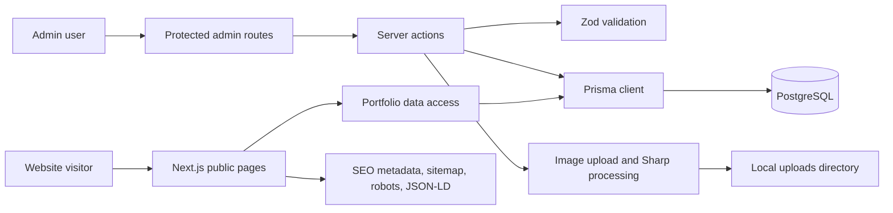

# 3D Printing Order Website

A production-oriented MVP website for a local 3D printing service. The project combines public service pages, portfolio content, SEO, an admin area, and a local image upload pipeline prepared for later server deployment.

By [Elisey Kochura (lolpul)](https://github.com/lolpul) · [Engineering portfolio](https://elisey.kochura.com).

## Live Demo

No public demo URL has been verified yet.

## Overview

The application helps customers understand available 3D printing services, browse portfolio examples, and contact the service owner with order details. It also includes an admin workflow for managing portfolio items, site settings, and uploaded images.

## My Role

I designed and implemented the web application structure, public pages, admin interface, server-side validation, Prisma data model, image processing flow, SEO metadata, and deployment-ready Docker setup.

## Key Features

- Public landing page for a 3D printing service
- Service detail pages for STL printing, sample-based manufacturing, 3D modeling, and small batch printing
- Portfolio listing and detail pages
- Admin authentication with an httpOnly cookie
- Portfolio management forms
- Site settings management
- Local image upload pipeline with MIME validation and Sharp processing
- SEO support with sitemap, robots.txt, canonical URLs, Open Graph metadata, and JSON-LD
- Docker and Docker Compose configuration for local/server deployment
- Health check API route

## Frontend Engineering

The frontend is built with the Next.js App Router and TypeScript. Public routes are organized around service pages, materials, FAQ, contacts, privacy, and portfolio content. Admin routes are separated under `/admin` and protected through server-side authentication checks.

Reusable components cover the site header and footer, breadcrumbs, contact buttons, portfolio cards, forms, confirmation buttons, analytics hooks, structured data, and placeholder images. Forms use Zod-backed validation on the server boundary. The UI is responsive and uses Tailwind CSS for layout, spacing, and typography.

## Architecture



## Technology Stack

Frontend:

- Next.js App Router
- React
- TypeScript
- Tailwind CSS
- lucide-react

Backend:

- Next.js server actions and route handlers
- Zod validation
- bcryptjs authentication helpers
- Sharp image processing

Database:

- PostgreSQL
- Prisma ORM

Infrastructure:

- Docker
- Docker Compose
- Example nginx reverse-proxy configuration

Testing and Tooling:

- Vitest
- ESLint
- TypeScript strict mode
- Prettier

## Engineering Challenges

- Built a split public/admin application without exposing admin pages to indexing.
- Added server-side validation for content and settings workflows.
- Designed an image upload path that validates MIME type, strips metadata through re-encoding, and creates multiple image sizes.
- Kept public pages usable in a demo/fallback mode while preserving a database-backed production path.
- Added SEO primitives without inventing fake ratings, reviews, or business metrics.

## Screenshots

Screenshots were captured from a local demo run using fictional contact data and fallback portfolio items.

| Home | Mobile Home |
| --- | --- |
|  |  |

| Portfolio | Order Contact Flow |
| --- | --- |
|  |  |

| Service Flow |
| --- |
|  |

## Running Locally

Install dependencies:

```bash
npm install
```

Create a local environment file from `.env.example` and fill in the required values:

```bash
cp .env.example .env
```

Run database migrations and seed data:

```bash
npm run db:migrate
npm run db:seed
```

Start the development server:

```bash
npm run dev
```

The local development URL is printed by Next.js in the terminal.

## Docker

```bash
docker compose up -d --build
docker compose exec app npx prisma migrate deploy
docker compose exec app npm run db:seed
```

The compose setup binds the application to the local machine by default and does not modify nginx, firewall, DNS, or system services.

## Testing

Detailed verification notes are available in [docs/verification.md](docs/verification.md).

```bash
npm run lint
npm run typecheck
npm run test
npm run build
```

For local demo builds without a database connection, use temporary environment variables such as `SKIP_DB=1` and a local placeholder `DATABASE_URL`. Do not commit real credentials.

## Deployment

This project is not a static GitHub Pages site. It uses server-side rendering, route handlers, server actions, Prisma, PostgreSQL, admin authentication, and image processing. A Node-capable host with database support is the correct deployment option.

## Security

Production credentials, user data, server addresses and private infrastructure configuration are intentionally excluded from this repository.

The public export must not include `.env`, upload contents, logs, local databases, build artifacts, private keys, production nginx/systemd files, or customer data.

## Project Status

MVP
